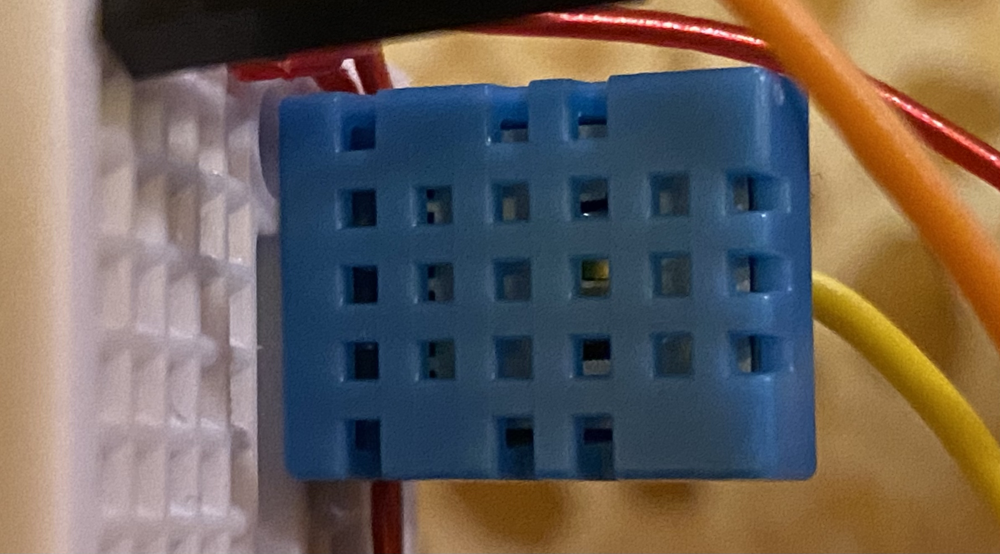
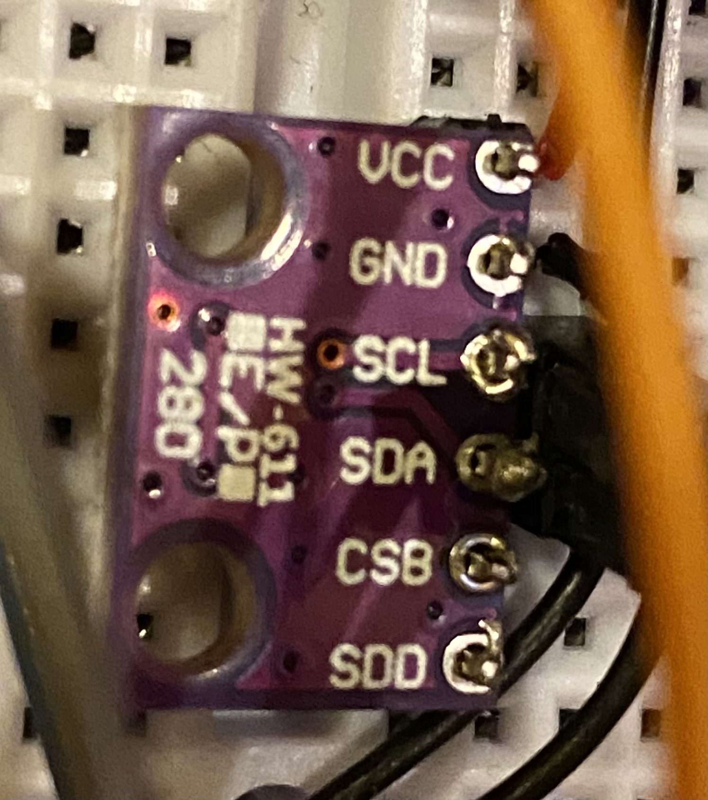
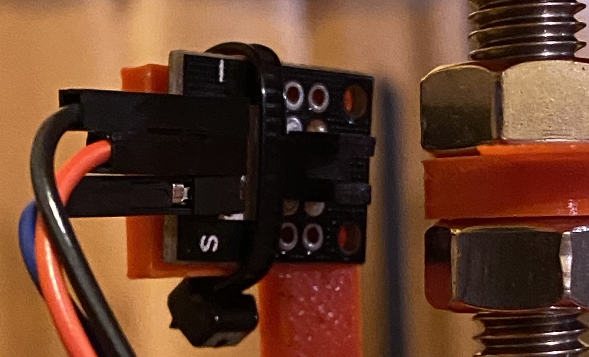

# LTAI Weather Station

Buna, suntem Team Aleph, elevi la Liceul Teoretic "Avram Iancu" Brad.

Acest proiect este o statie meteo inteligenta, a caror valori pot fi citite atat de pe aplicatiile de pe iOS si Android, cat si de pe aplicatia Web

## Dependencies

### Hardware

Aceasta statie a fost realizata cu ajutorul unui Raspberry Pi 4

Un senzor de umiditate si temperatura DHT11

Un senzor de temperatura BMP280

Un breaker de laser

Un panou solar si un holder de baterii

Restul pieselor au fost realizate cu ajutorul imprimantei 3D Prusa Mini

### Software - RPi

Software-ul pentru Raspberry Pi depinde de libraria Adafruit_DHT
https://github.com/adafruit/DHT-sensor-library

### Software - iOS App

Software-ul a fost scris in XCode, in limbajul Swift, cu ajutorul librariei iOS Standard: SwiftUI

### Software - Android App

Software-ul a fost scris in Android Studio, in limbajul Java

Graficele au fost realizate cu ajutorul librariei jjoe64/GraphView
https://github.com/jjoe64/GraphView

### Software - Web App

Software-ul a fost scris cu ajutorul framework-ului React.js, in limbajul JavaScript
https://github.com/facebook/react

### Software - API

Software-ul a fost scris in Java, pentru deployment in AWS Lambda
https://aws.amazon.com/lambda/

Scris cu ajutorul domnului profesor Romulus Ioan Pasca
https://github.com/motoras/

## Team Aleph

> Proiect realizat de:
>> Chifor Darius - Hardware, RPi Software, iOS App https://github.com/DaryusOctavian \
>> Feier Raul    - Web App, Android App https://github.com/RaulFeier